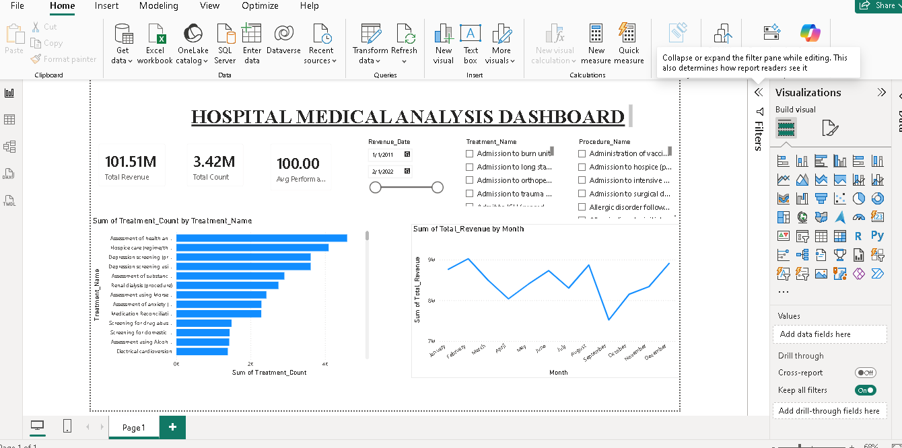

# Medical and Patient Record Analysis

A SQLite-based healthcare analytics project that transforms raw hospital data into structured analytical views for operational, clinical, patient, and financial reporting.

---

# Project Overview

This project was developed to analyze healthcare operations using SQL and business intelligence reporting techniques. The database was transformed into clean analytical layers that support reporting across patient activity, hospital operations, doctor performance, treatment demand, and revenue analysis.

The project focuses on:

- Patient demographics and repeat-visit behavior
- Appointment activity and visit status
- Treatment demand and treatment cost patterns
- Monthly revenue and insurance contribution
- Payer performance analysis
- Doctor performance and specialization demand

The final outputs were used to support dashboard reporting and business insight generation.

---

# Tools & Technologies

- SQLite
- SQL
- Power BI
- CSV
- Data Modeling
- Business Intelligence Reporting

---

# Repository Contents

```text
Hospital_db.db                     -> SQLite database
Hosptal Codes.txt                  -> SQL scripts used to create analytical views
patient_summary.csv                -> Patient-level analytical output
appointment_summary(1).csv         -> Appointment-level analytical output
treatment_summary(1).csv           -> Treatment-level analytical output
revenue_summary(1).csv             -> Monthly revenue analysis
payer_summary(1).csv               -> Payer performance analysis
doctor_summary.csv                 -> Doctor performance analysis
Medical Analysis Dashboard.pdf     -> Dashboard preview
Health Database.png                -> Dashboard image preview
```

---

# Data Model Structure

## Clean Views

The project begins by transforming the raw database into standardized clean views:

- `clean_patients`
- `clean_encounters`
- `clean_treatments`
- `clean_payers`
- `clean_organizations`

These views standardize field names, convert dates, and prepare the data for reporting and analytics.

---

# Analytical Summary Views

The following analytical views were created from the cleaned tables:

- `patient_summary`
- `appointment_summary`
- `treatment_summary`
- `revenue_summary`
- `payer_summary`
- `doctor_summary`

---

# Key Analytical Outputs

## Patient Summary

Includes patient demographics and behavioral metrics such as:

- Patient name
- Gender
- Birth date
- Age
- Age distribution
- City and state
- Total visits
- Lifetime spend
- Average visit cost
- Out-of-pocket cost
- Patient category

---

## Appointment Summary

Provides operational and billing-level details including:

- Encounter ID
- Encounter date
- Encounter class
- Visit description
- Patient name
- Hospital name
- Payer name
- Doctor name
- Specialization
- Location
- Total claim cost
- Payer coverage
- Patient payment
- Payment status
- Appointment status

---

## Treatment Summary

Supports treatment demand and cost analysis:

- Treatment frequency
- Average treatment cost
- Total treatment cost
- Minimum treatment cost
- Maximum treatment cost

---

## Revenue Summary

Supports monthly financial reporting:

- Total encounters
- Total revenue
- Insurance coverage
- Patient payments
- Average revenue per visit

---

## Payer Summary

Analyzes payer contribution and claim performance:

- Total claims
- Total claim amount
- Total covered amount
- Average claim cost

---

## Doctor Summary

Supports doctor performance analysis:

- Doctor name
- Specialization
- City and state
- Encounter ID
- Encounter date
- Appointment status
- Total claim cost

---

# Dashboard Highlights

The dashboard was designed around four major reporting areas.

## Executive Dashboard

- Total revenue
- Total patients
- Total appointments
- Revenue trend

## Patient Analytics

- Gender distribution
- Age groups
- Repeat vs one-time patients
- Top diagnoses

## Financial Analytics

- Revenue by payer
- Insurance coverage
- Monthly revenue
- Top spenders

## Operational Analytics

- Encounter classes
- Hospital workload
- Appointment trends

---
ER Diagram

This diagram shows the relationship between patients, encounters, treatments, doctors, payers, and hospital organizations.


# Dashboard Preview



---

# How to Use

1. Open the SQLite database using any SQLite client.
2. Run the SQL script in `Hosptal Codes.txt`.
3. Create the clean and summary analytical views.
4. Export views into CSV files if needed.
5. Use the outputs in Power BI, Excel, Tableau, or any BI tool for reporting and visualization.

---

# SQL Views Included

## clean_patients
Standardizes patient demographic information.

## clean_encounters
Structures encounter details including revenue, claim cost, and patient payments.

## clean_treatments
Standardizes procedure and treatment records.

## clean_payers
Normalizes payer details and locations.

## clean_organizations
Standardizes hospital and organization records.

## patient_summary
Supports demographic and repeat-patient analysis.

## appointment_summary
Combines patient, encounter, payer, hospital, and doctor information for operational reporting.

## treatment_summary
Aggregates treatment demand and cost statistics.

## revenue_summary
Aggregates monthly revenue and insurance values.

## payer_summary
Summarizes payer contribution and claims performance.

## doctor_summary
Creates doctor-level analytical reporting.

---

# Suggested GitHub Structure

```text
.
├── Hospital_db.db
├── Hosptal Codes.txt
├── Medical Analysis Dashboard.pdf
├── Health Database.png
├── doctor_summary.csv
├── patient_summary.csv
├── appointment_summary(1).csv
├── treatment_summary(1).csv
├── revenue_summary(1).csv
├── payer_summary(1).csv
└── README.md
```

---

# Project Purpose

This project provides a healthcare analytics foundation for monitoring patient activity, operational efficiency, treatment demand, payer contribution, doctor performance, and hospital financial performance using SQL and business intelligence reporting techniques.
